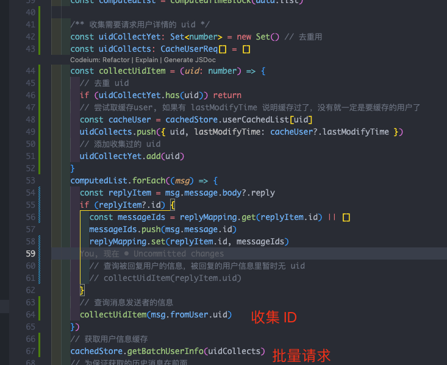
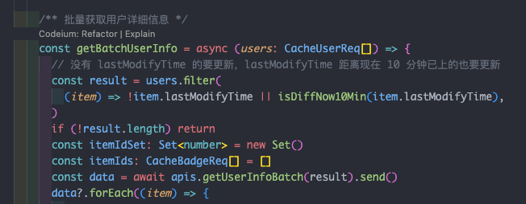
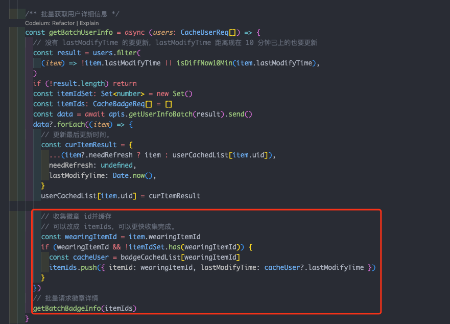
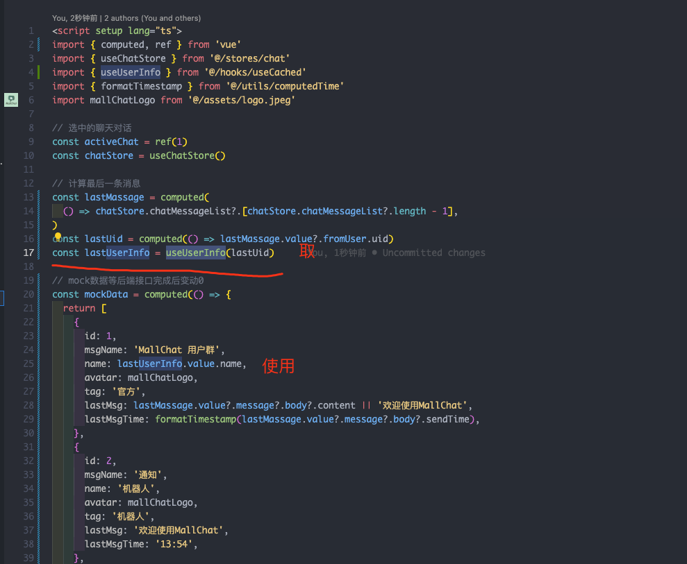
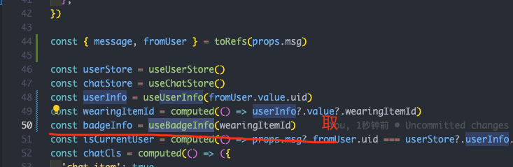
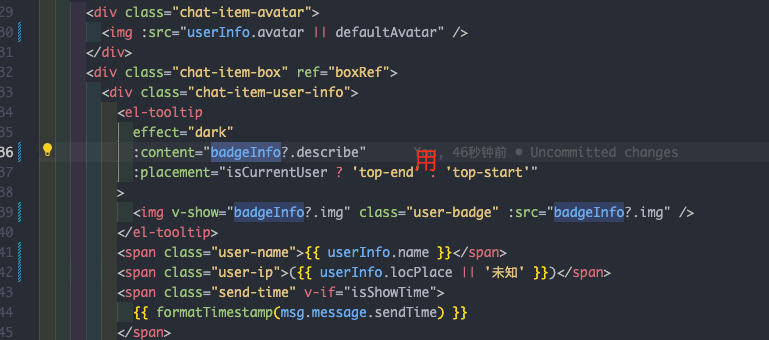

# 成员缓存改版方案

## 背景

现在的消息列表里面，每条消息的内容很冗余，每条消息的发送者信息和回复者信息都大量重复，包括头像，徽章，用户名等信息。

为了 “精简”，决定缓存用户和徽章信息，消息体里面后面只用传 uid 及其他必要信息。
用户信息先从本地缓存取，没有就去接口懒加载。
一次取的大概一页 20 人的内容，改版后第一次进入页面会拉取 <=40 成员(消息列表 20 人 + 群成员 20 人, 可能有重复，需去重) 的信息进行缓存

## 实施

- 使用插件 `pinia-plugin-persistedstate` 把 `pinia` 缓存到 `localStorage`，原计划 是使用 `indexDB`, 但是 `indexDB` 是异步的，经测试：缓存的用户数据也不算太大，几百 k，用 `localStorage` 妥妥的够了。
- 收据收集批量获取流程
  - 在拿消息列表的时候，从消息列表里面循环取出 `uid` 集合，然后取批量请求用户信息之前，从 `uid` 集合里面筛选出没有 `lastModifyTime` 字段的(说明是第一次拿，有一定是缓存过了) 和有 `lastModifyTime`但是 `lastModifyTime` 距离现在已经超过 10 分钟了的，才去批量请求。
    
    
  - 同样的在拿群成员列表的时候，也做上面的处理循环出需要拿详情的用户
    
  - 这里存在一个问题，第一次进页面的时候，消息列表和群成员列表是分开异步请求的。所以可能会导致第一次的时候，两个请求的 uid 列表会存在部分重复，不过也不好做成同步处理，做成同步可以解决重复，但是注定一个会慢一点，所以就不处理重复问题。
  - 在翻页消息和群成员的时候，会重复上面的收集和缓存流程。
  - 徽章缓存，在上面的用户批量请求完成后返回的数据里面做收集、请求、缓存.
    
- 用户缓存信息的使用：将所有原来从消息的 `fromUser` 对象里面取的 除了 `uid` 的内容，全部从 `useUserInfo(hook)` 取，该 `hook` 是响应式的，只需传入 `uid`，等到用户信息有了，会自动更新出来。
  
- 徽章缓存信息的使用：将所有原来从消息的 `fromUser.badge` 对象里面取的 `img`、`describe`，全部从 `useBadgeInfo(hook)` 取，该 `hook` 是响应式的，只需传入 `itemId`，等到徽章信息有了，会自动更新出来。
  
  
